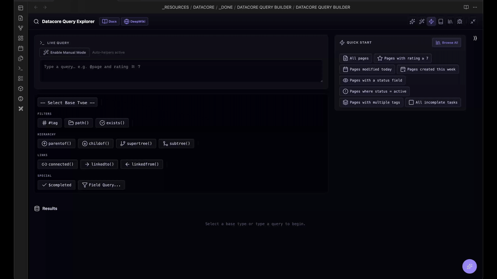
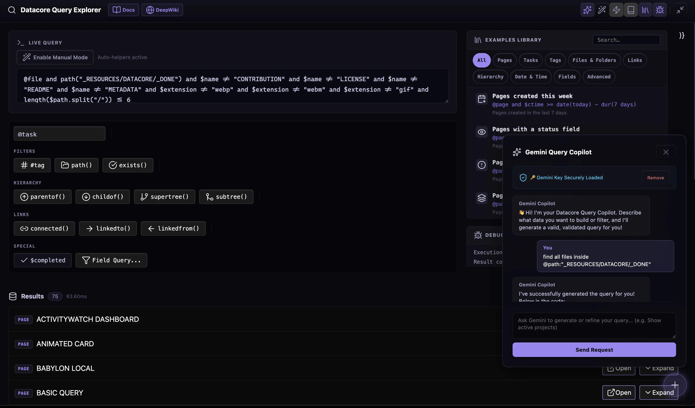

<div align="center">
  <a name="readme-top"></a>
  
  <h1 align="center">DATACORE QUERY BUILDER</h1>
  <h3 align="center"> A Polished Visual Query Explorer and Assistant for Obsidian </h3>
</div>

<div align="center">
  <!-- TOP PURPLE LINKS -->
  <a href="https://beto.group"></a>
  <a href="https://discord.com/invite/6rDp4q4Y2B"></a>
  <a href="https://github.com/sponsors/beto-group"></a>
  <br/>
  <!-- BOTTOM GOLD TAXONOMY -->
  
  
  
  <hr>
</div>



<div align="center">
  <p><i>A polished visual query builder and real-time result explorer for Datacore. Accelerate your Obsidian query workflows using instant syntax helpers, operators modifier overlays, and an inline AI query assistant.</i></p>
</div>

---

## 📌 Introduction & Overview

**Datacore Query Builder** is a powerful visual workspace tool designed to run completely inside your Obsidian vault. It offers a live, interactive environment for writing and testing Datacore queries with real-time feedback and visualization.

The builder streamlines query development with a modular dashboard featuring base-type selections, syntax and property helper wizards, live operators modifiers, and a PiP-style floating AI assistant chat that learns from your conversations.

---

## ✨ Features

### 🔍 Interactive Query Builder
*   **Base Types Selector**: Instantly choose the root Datacore search space (`@page`, `@task`, `@file`, etc.).
*   **Property & Tag Wizards**: Live autocomplete lookup for all available frontmatter fields and tags in your vault.
*   **Operators Overlay**: Easily click on operators (`AND`, `OR`, `!not`) in the query text area to modify them through a dropdown overlay menu.
*   **Live Run Loop**: Debounced automatic queries execute in real time, showing paginated results with collapsible JSON metadata details.

### 🤖 AI Query Assistant
*   **Multi-Provider Integration**: Configure Google Gemini, OpenAI, Anthropic Claude, or Groq API keys securely in the local vault settings.
*   **PiP Floating Window**: An interactive, draggable floating assistant chat that is always available.
*   **Auto-Knowledge Extractor**: Learns custom rules, limitations, and successful query examples during the conversation to continuously optimize helper prompts.

---

## 🚀 Quick Start & Installation

Getting started with **Datacore Query Builder** is simple and fast:

1. **Download / Get the Code**:
   * **Option A**: Clone this folder directly into your Obsidian vault directory:

```bash
git clone https://github.com/beto-group/DatacoreQueryBuilder
```
   
   * **Option B**: Download the repository as a ZIP archive, extract it, and place the extracted `DATACORE QUERY BUILDER` folder anywhere inside your Obsidian vault.

2. **Verify Prerequisites**:
   * Ensure you have the **Datacore** plugin installed and enabled in your Obsidian Community Plugins settings.

3. **Launch the Builder**:
   * Open Obsidian, navigate to the file list, and open **`DATACORE QUERY BUILDER.md`**.
   * The visual interface will boot up instantly and automatically index your vault!

---

## 📦 Directory Index & Components

The package exposes the following modular files:

| File | Description |
| :--- | :--- |
| **[DATACORE QUERY BUILDER.md](DATACORE%20QUERY%20BUILDER.md)** | The Obsidian active rendering note wrapper |
| **[src/index.jsx](src/index.jsx)** | Hook-safe Preact view bootstrapper and polling HMR watch daemon |
| **[src/App.jsx](src/App.jsx)** | Main layout orchestrator coordinating state and views |
| **[src/components/ResultItem.jsx](src/components/ResultItem.jsx)** | Results item list renderer with collapsible details |
| **[src/components/Helpers.jsx](src/components/Helpers.jsx)** | Autocomplete suggestions widgets for properties, folders, files, and tags |
| **[src/components/AISettingsModal.jsx](src/components/AISettingsModal.jsx)** | Local API configuration Modal dialog supporting multiple providers |
| **[src/components/AIChat.jsx](src/components/AIChat.jsx)** | Drag-and-drop floating window chat helper |
| **[src/utils/domUtils.js](src/utils/domUtils.js)** | DOM helper utilities supporting full-tab pane reparenting |
| **[src/utils/loadScript.js](src/utils/loadScript.js)** | Local script cache manager and loader |
| **[data/mcp_commands.json](data/mcp_commands.json)** | Hot Module Replacement (HMR) daemon trigger file |
| **[METADATA.md](METADATA.md)** | Machine-readable component packaging manifest |
| **[CONTRIBUTION.md](CONTRIBUTION.md)** | Developer standards and contribution guidelines |
| **[LICENSE.md](LICENSE.md)** | The MIT permissible software distribution license |

## Previews

<div align="center">
  
</div>


